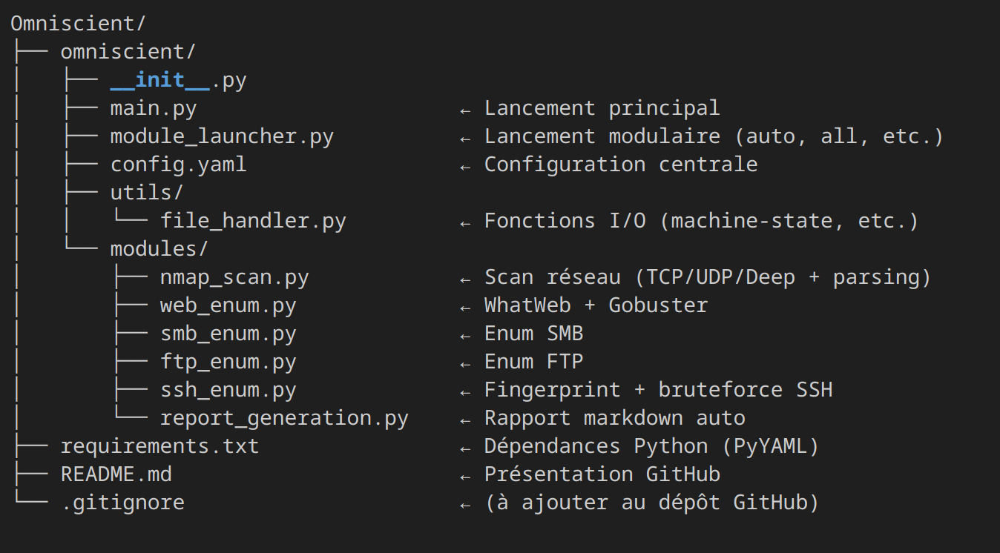
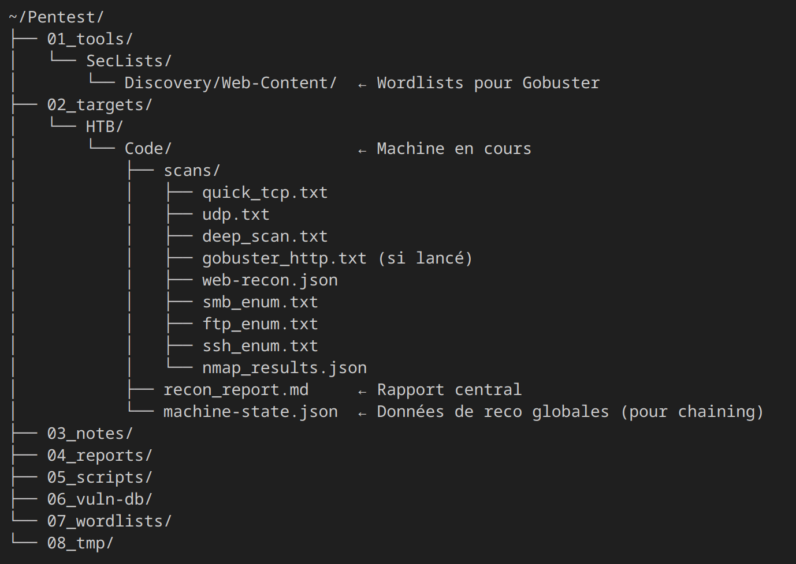

# Omniscient

**Automated Offensive Recon Framework**  
Projet perso cyber – Reconnaissance, Enumération & Reporting

---

## 📌 Présentation

**Omniscient** est un outil modulaire de reconnaissance automatisée, conçu pour assister les phases de **pentest** et de **CTF** (Il est actuellement uniquement utilisé avec des inputs HackTheBox et donc pour l'instant uniquement fonctionnel pour des boxs de ce type).
Il permet de lancer rapidement une suite cohérente de scans, d’enrichir dynamiquement la cartographie d’une cible, et de produire un rapport clair et exploitable.

Le projet est **en cours de développement** et amené à évoluer vers une solution complète avec interface graphique, smart chaining (enchainement des outils selons résultats précédents), analyse de vulnérabilités, dockerisation et plus.

L'objectif final est d'avoir un outil complet, éducatif et intelligent avec une intégration d'un LLM en Model Context Protocol afin d'orienter l'exploitation post-reconnaissance. C'est une façon pour moi de progresser et de développer mes connaissances sur différents aspects qui m'intéresses. 

---

## ⚙️ Fonctionnalités actuelles et à venir

- [x] **Scan Nmap** (TCP, UDP, vulnérabilités, résultats parsé pour permettre la réutilisation par d'autres modules)
- [x] **Reconnaissance Web** (WhatWeb, énumération Gobuster)
- [x] **Enum SMB / FTP / SSH** (test des partages, test accès invité, bruteforce léger)
- [x] **Machine-state.json** centralisé (état machine enrichi dynamiquement pour permettre aux modules d'avoir plus d'infos)
- [x] **Smart chaining** automatique de modules en fonction des services détectés
- [x] **Rapport Markdown** généré automatiquement (à travailler)
- [x] Structure organisée et évolutive (modules isolés et indépendants, config YAML)
- [ ] **Reconnaissance AD** en cours d'implémentation
- [ ] **Scan de vulnérabilités**
- [ ] **Interface graphique**
- [ ] **Dockerisation**
- [ ] **Intégration Model Context Protocol**
- [ ] Et bien plus :)

---

## 📁 Arborescence

### Omniscient :




### Arboresence d'environnement pentest :




Pour créer l'arbo d'environnement Pentest : 
```bash
mkdir -p ~/Pentest/{01_tools,02_targets/HTB,02_targets/TryHackMe,03_notes/cheatsheets,04_reports,05_scripts,06_vuln-db,07_wordlists,08_tmp}
```

---

## 🚀 Utilisation

### Lancement principal :
```bash
sudo -E python3 ~/Omniscient/omniscient/main.py --target <NomMachine> --platform <HTB> --ip <IP>
```

### Mode auto (smart chaining)
```bash
sudo -E python3 ~/Omniscient/omniscient/module_launcher.py --mode auto --target <NomMachine> --platform <HTB> --ip <IP>
```

### Mode all (tout exécuter sauf nmap)
```bash
sudo -E python3 ~/Omniscient/omniscient/module_launcher.py --mode all --target <NomMachine> --platform <HTB> --ip <IP>
```

### Module unique
```bash
python3 ~/Omniscient/omniscient/module_launcher.py --module <NomModule> --target <NomMachine> --platform <HTB> --ip <IP>
```

---

## 🔧 Installation

```bash
git clone https://github.com/lapouj/Omniscient.git
cd Omniscient
pip install -r requirements.txt
```

## ⚡ Pré-requis

- Python 3.8+
- nmap, whatweb, gobuster, enum4linux, smbmap, ftp, sshpass, nc 
- SecLists installé dans ~/Pentest/01_tools/
- OS Linux (distro offensive recommandée)

Pour installer les outils :
```bash
sudo apt install -y $(cat apt-packages.txt)
```

---

## 🤝 Contribuer

Le projet est en cours de développement.
Toute idée, retour, contribution ou collaboration est bienvenue.

N'hésitez pas à me contacter via LinkedIn.

